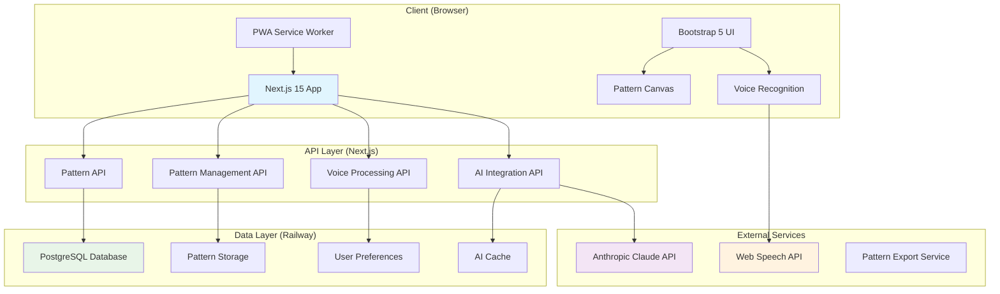

# Emoty Web App - Project Overview

## Project Vision

Transform the successful Android Emoty app into a modern, accessible web application that preserves all core functionality while leveraging cutting-edge web technologies. The web version will maintain feature parity with the Android app while introducing web-specific enhancements and improved accessibility.

## Technology Stack

### Core Framework: Next.js 15

**Why Next.js 15?**
- **React 19 Support**: Latest React features for optimal performance
- **Turbopack Stable**: 96% faster development builds for pattern rendering
- **Built-in API Routes**: Perfect for Anthropic Claude integration
- **Excellent SEO**: Server-side rendering for pattern sharing
- **Railway Optimized**: One-click deployment with automatic optimization
- **TypeScript First**: Better maintainability for complex pattern algorithms
- **PWA Ready**: Offline pattern creation capabilities

### UI Framework: Bootstrap 5

**Why Bootstrap 5?**
- **Accessibility First**: Built-in WCAG compliance features
- **Mobile Responsive**: Essential for touch-based emoji selection
- **Customizable**: Easy theming for light/dark modes
- **Voice Control Ready**: Compatible with screen readers and voice navigation
- **Proven Reliability**: Stable foundation for complex UI interactions
- **Rapid Development**: Pre-built components for faster iteration

## System Architecture

## Core Features Mapping

### Android → Web Equivalents

| Android Feature | Web Implementation | Technology |
|----------------|-------------------|------------|
| **Pattern Canvas** | HTML5 Canvas + React | Canvas API + Bootstrap Grid |
| **Emoji Palettes** | Horizontal Scrolling Cards | Bootstrap Carousel + CSS Grid |
| **Voice Commands** | Web Speech API + AI Processing | Web Speech API + Claude |
| **Pattern Storage** | PostgreSQL + IndexedDB | Railway PostgreSQL + PWA |
| **AI Integration** | Server-side Claude API | Next.js API Routes |
| **Accessibility** | Screen Reader + Voice Navigation | WCAG 2.1 AA + ARIA |
| **Printing** | Web Print API + PDF.js | Browser Print + jsPDF |
| **Multi-language** | next-i18next | Built-in i18n support |

## Architecture Principles

### 1. Accessibility First
- **WCAG 2.1 AA Compliance**: All components meet accessibility standards
- **Screen Reader Optimized**: Semantic markup with proper ARIA labels
- **Voice Navigation**: Complete hands-free operation capability
- **Motor Disability Support**: Large touch targets, simplified gestures
- **Keyboard Navigation**: Full functionality without mouse/touch

### 2. Progressive Enhancement
- **Core Functionality**: Works without JavaScript for basic pattern viewing
- **Enhanced Experience**: Rich interactions with JavaScript enabled
- **Offline Capability**: PWA features for pattern creation without internet
- **Adaptive Performance**: Degrades gracefully on slower devices

### 3. Mobile-First Design
- **Touch Optimized**: Gesture-based emoji selection and pattern manipulation
- **Responsive Breakpoints**: Seamless experience across all screen sizes
- **Performance Focused**: Optimized for mobile data usage and battery life
- **PWA Features**: Install to home screen, offline functionality

### 4. API-Driven Architecture
- **Microservices Pattern**: Separate APIs for patterns, AI, voice, and management
- **Cacheable Responses**: Optimized for performance and reduced API costs
- **Fallback Systems**: Graceful degradation when external services fail
- **Rate Limiting**: Protection against abuse while maintaining usability

## Performance Targets

### Core Metrics
- **First Contentful Paint**: < 1.5s
- **Largest Contentful Paint**: < 2.5s
- **Cumulative Layout Shift**: < 0.1
- **First Input Delay**: < 100ms
- **Pattern Rendering**: < 100ms for sequences up to 10 emojis

### Accessibility Metrics
- **Lighthouse Accessibility Score**: 100
- **Screen Reader Compatibility**: 100% VoiceOver/NVDA/JAWS
- **Keyboard Navigation**: Complete functionality without mouse
- **Color Contrast**: WCAG AAA standards (7:1 ratio)

## Security & Privacy

### Data Protection
- **Minimal Data Collection**: Only essential pattern and preference data
- **GDPR Compliance**: Clear consent mechanisms and data deletion
- **COPPA Compliant**: Safe for users under 13
- **Local-First**: Patterns stored locally with optional cloud sync

### API Security
- **Rate Limiting**: Protect against AI API abuse
- **Input Sanitization**: Prevent injection attacks on user prompts
- **Content Filtering**: Block inappropriate AI-generated content
- **Secure Storage**: Encrypted sensitive data in database

## Deployment Strategy

### Railway Platform Optimization
- **One-Click Deployment**: Automated build and deployment pipeline
- **Environment Management**: Separate dev/staging/production environments
- **Auto-scaling**: Automatic resource allocation based on usage
- **Database Management**: Managed PostgreSQL with automatic backups

### CI/CD Pipeline
- **Automated Testing**: Unit, integration, and accessibility tests
- **Performance Monitoring**: Real-time performance metrics and alerts
- **Security Scanning**: Automated vulnerability detection
- **Progressive Deployment**: Safe rollout with automatic rollback

## Success Metrics

### User Experience
- **Pattern Creation Time**: < 30 seconds for simple patterns
- **Voice Command Accuracy**: > 95% recognition rate
- **Accessibility Compliance**: 100% WCAG 2.1 AA conformance
- **Mobile Performance**: Smooth 60fps animations on mid-range devices

### Technical Performance
- **API Response Time**: < 200ms for pattern operations
- **AI Generation Time**: < 3 seconds for pattern suggestions
- **Cache Hit Ratio**: > 80% for common patterns and AI responses
- **Uptime**: 99.9% availability target

### Business Metrics
- **Feature Parity**: 100% Android feature equivalence by launch
- **User Adoption**: 70% of Android users try web version
- **Performance Improvement**: 25% faster pattern creation than Android
- **Accessibility Reach**: 15% increase in users with disabilities

## Next Steps

1. **Phase 1**: Core pattern engine and basic UI (4 weeks)
2. **Phase 2**: AI integration and voice commands (3 weeks)
3. **Phase 3**: Accessibility and advanced features (3 weeks)
4. **Phase 4**: Deployment and optimization (2 weeks)

Total estimated timeline: **12 weeks** for full feature parity and Railway deployment.

---

*This document serves as the foundation for all technical decisions and implementation approaches for the Emoty web application.*