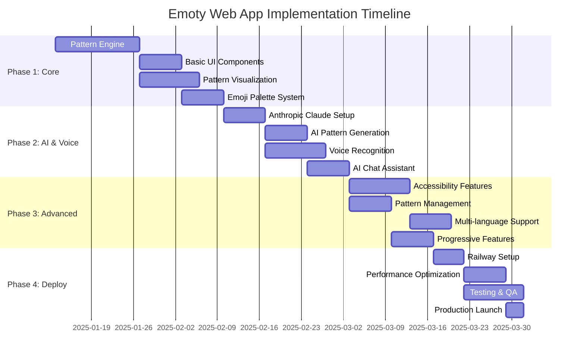

# Emoty Web App - Implementation Phases

## Overview

This document outlines the comprehensive 4-phase implementation strategy for converting the Android Emoty app to a modern web application. Each phase builds upon the previous, ensuring a systematic approach that maintains quality while delivering incremental value.

## Phase Timeline



---

## Phase 1: Core Foundation (4 weeks)

**Goal**: Establish the fundamental pattern creation and visualization system

### Week 1: Project Setup & Pattern Engine

#### 1.1 Next.js 15 Project Setup
- **Initialize Next.js 15 project** with TypeScript and ESLint
- **Configure Bootstrap 5** with custom theme variables
- **Setup Railway deployment** configuration files
- **Database schema design** for patterns and preferences

**Deliverables:**
- Working Next.js 15 project structure
- Bootstrap 5 integration with custom themes
- Railway deployment configuration
- Initial database migrations

#### 1.2 Core Pattern Engine
- **Implement pattern algorithms** (concentric squares, sequential mode)
- **Pattern state management** with Zustand store
- **Pattern validation** and error handling
- **Pattern export utilities** (text, JSON)

**Key Components:**
```typescript
// Core pattern calculation engine
class PatternEngine {
  generateConcentricPattern(sequence: string[]): GridCell[][]
  generateSequentialPattern(sequence: string[]): GridCell[][]
  validatePattern(pattern: PatternState): ValidationResult
}

// Pattern state management
interface PatternState {
  sequence: string[];
  insertionIndex: number;
  patternMode: 'concentric' | 'sequential';
  patternSize: number;
}
```

### Week 2: Basic UI Components

#### 2.1 Layout Structure
- **Main application layout** with Bootstrap grid system
- **Navigation components** with accessibility features
- **Responsive breakpoints** for mobile-first design
- **Theme switcher** for light/dark modes

#### 2.2 Pattern Canvas Component
- **HTML5 Canvas implementation** for pattern rendering
- **Real-time pattern updates** with React state
- **Canvas optimization** for smooth 60fps animations
- **Touch gesture support** for mobile interaction

**Component Structure:**
```typescript
interface PatternCanvasProps {
  pattern: GridCell[][];
  onCellClick?: (row: number, col: number) => void;
  readonly?: boolean;
  className?: string;
}
```

### Week 3: Pattern Visualization

#### 3.1 Advanced Canvas Features
- **Emoji rendering optimization** with proper Unicode support
- **Pattern animations** for insertion and deletion
- **Export functionality** (PNG, SVG, PDF)
- **Print optimization** for A4 format

#### 3.2 Pattern Editor
- **Sequence editor component** with drag-and-drop
- **Insertion point indicators** for visual feedback
- **Undo/redo functionality** with command pattern
- **Pattern preview modes** (edit vs. view)

### Week 4: Emoji Palette System

#### 4.1 Palette Components
- **Horizontal carousel implementation** with Bootstrap
- **23 curated palette themes** matching Android version
- **Palette pagination** and smooth transitions
- **Search functionality** within palettes

#### 4.2 Emoji Selection
- **Emoji picker component** with category filtering
- **Unicode normalization** for consistent rendering
- **Keyboard navigation** for accessibility
- **Recently used emojis** tracking

**Palette Data Structure:**
```typescript
interface EmojiPalette {
  id: string;
  name: { en: string; fr: string };
  category: 'color' | 'monochrome';
  emojis: string[];
  description?: string;
}
```

---

## Phase 2: AI Integration & Voice Commands (3 weeks)

**Goal**: Implement intelligent features that differentiate the app

### Week 1: Anthropic Claude Integration

#### 1.1 API Setup
- **Next.js API routes** for Claude integration
- **Environment configuration** for API keys
- **Rate limiting** and cost control measures
- **Error handling** and fallback mechanisms

#### 1.2 AI Pattern Generation
- **Prompt engineering** for pattern creation
- **Pattern validation** of AI responses
- **Rationale extraction** for user understanding
- **Context preservation** across requests

**API Endpoint Structure:**
```typescript
// /api/ai/generate-pattern
interface PatternGenerationRequest {
  prompt: string;
  language: 'en' | 'fr';
  complexity?: 'simple' | 'moderate' | 'complex';
}

interface PatternGenerationResponse {
  patterns: {
    sequence: string[];
    rationale: string;
    confidence: number;
  }[];
}
```

### Week 2: Voice Recognition System

#### 2.1 Web Speech API Integration
- **Speech recognition setup** with fallback support
- **Multi-language support** (English/French)
- **Voice command parsing** and interpretation
- **Audio feedback** for user confirmation

#### 2.2 Voice Pattern Creation
- **Natural language processing** for emoji requests
- **Voice command validation** and error handling
- **Visual feedback** during voice recognition
- **Hands-free navigation** capabilities

**Voice Command Patterns:**
```typescript
interface VoiceCommand {
  type: 'add_emoji' | 'navigate' | 'action';
  intent: string;
  entities: string[];
  confidence: number;
}
```

### Week 3: AI Chat Assistant (EmotyBot)

#### 3.1 Chat Interface
- **Chat UI component** with Bootstrap styling
- **Message threading** and conversation history
- **Typing indicators** and loading states
- **Clickable pattern suggestions** for immediate use

#### 3.2 Conversational AI
- **Context-aware responses** based on current pattern
- **Pattern suggestions** embedded in conversations
- **Multi-turn conversations** with memory
- **Conversation export** and sharing

---

## Phase 3: Advanced Features & Accessibility (3 weeks)

**Goal**: Ensure world-class accessibility and advanced functionality

### Week 1: Accessibility Implementation

#### 1.1 WCAG 2.1 AA Compliance
- **Screen reader optimization** with proper ARIA labels
- **Keyboard navigation** for all functionality
- **Color contrast compliance** (minimum 4.5:1 ratio)
- **Focus management** for complex interactions

#### 1.2 Motor Accessibility
- **Large touch targets** (minimum 44px)
- **Gesture alternatives** for swipe actions
- **Voice navigation** for hands-free operation
- **Customizable interface scaling** for user preferences

**Accessibility Testing Checklist:**
- [ ] NVDA/JAWS/VoiceOver compatibility
- [ ] Keyboard-only navigation
- [ ] Color blindness simulation
- [ ] High contrast mode support
- [ ] Voice control integration

### Week 2: Pattern Management System

#### 2.1 Pattern Library
- **Pattern saving** with automatic naming
- **Search and filtering** capabilities
- **Favorites system** with tagging
- **Bulk operations** (delete, export, share)

#### 2.2 Data Persistence
- **IndexedDB storage** for offline patterns
- **Cloud sync** with PostgreSQL
- **Import/export** functionality
- **Pattern sharing** via URLs

### Week 3: Multi-language & Progressive Features

#### 3.1 Internationalization
- **next-i18next setup** for multi-language support
- **French localization** matching Android version
- **RTL language preparation** for future expansion
- **Dynamic language switching** without page reload

#### 3.2 Progressive Enhancement
- **User level system** for feature revelation
- **Onboarding tutorial** with interactive guidance
- **Progressive Web App** features
- **Offline functionality** with service workers

---

## Phase 4: Deployment & Optimization (2 weeks)

**Goal**: Production-ready deployment with optimal performance

### Week 1: Railway Deployment

#### 1.1 Production Setup
- **Railway environment configuration** for production
- **Database migrations** and seed data
- **Environment variable management** for secrets
- **SSL certificate** and domain configuration

#### 1.2 Performance Optimization
- **Bundle analysis** and code splitting
- **Image optimization** for emoji assets
- **Caching strategies** (ISR, SWR, Redis)
- **CDN setup** for static assets

### Week 2: Testing & Launch

#### 2.1 Comprehensive Testing
- **Unit tests** with Jest and React Testing Library
- **Integration tests** for API endpoints
- **Accessibility testing** with axe-core
- **Performance testing** with Lighthouse CI

#### 2.2 Production Launch
- **Monitoring setup** with error tracking
- **Analytics integration** for usage insights
- **Documentation finalization** for maintainers
- **Launch checklist** and rollback procedures

---

## Resource Allocation

### Team Structure (Recommended)
- **Frontend Developer** (1 FTE): UI components, Canvas, Bootstrap
- **Full-Stack Developer** (1 FTE): API integration, Voice, AI features
- **Accessibility Specialist** (0.5 FTE): WCAG compliance, testing
- **QA Engineer** (0.5 FTE): Testing, documentation, deployment

### Technology Budget
- **Railway Pro Plan**: $20/month for production hosting
- **Anthropic Claude API**: ~$50-100/month estimated usage
- **Development Tools**: Vercel for preview deployments
- **Monitoring**: Free tier services (Railway insights, Sentry)

## Risk Mitigation

### High-Risk Items
1. **Web Speech API limitations** → Fallback to text input
2. **Claude API rate limits** → Implement caching and queuing
3. **Canvas performance on mobile** → Optimize rendering pipeline
4. **Accessibility edge cases** → Extensive testing with real users

### Contingency Plans
- **API fallbacks** for offline functionality
- **Progressive enhancement** for older browsers
- **Performance budgets** with automatic alerts
- **Rollback procedures** for production issues

## Success Criteria

### Phase 1 Success
- [ ] Pattern creation works on desktop and mobile
- [ ] Bootstrap UI matches design specifications
- [ ] Canvas rendering performs at 60fps
- [ ] Basic Railway deployment successful

### Phase 2 Success
- [ ] AI pattern generation < 3 seconds
- [ ] Voice recognition > 95% accuracy
- [ ] Chat assistant provides relevant suggestions
- [ ] API costs under budget projections

### Phase 3 Success
- [ ] WCAG 2.1 AA compliance verified
- [ ] Pattern management fully functional
- [ ] Multi-language switching works seamlessly
- [ ] PWA features operational offline

### Phase 4 Success
- [ ] Production deployment stable
- [ ] Performance metrics meet targets
- [ ] Monitoring and alerts operational
- [ ] Documentation complete and accurate

---

*This phased approach ensures systematic development while maintaining quality standards and accessibility compliance throughout the process.*