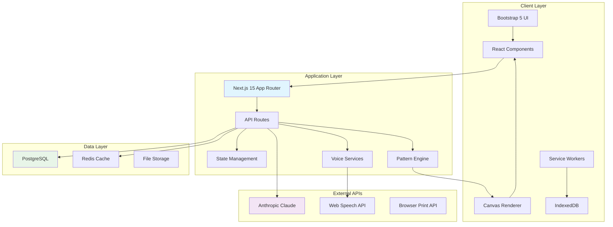
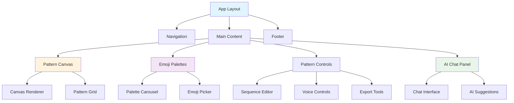

# Emoty Web App - Technical Specifications

## Architecture Overview

The Emoty web application follows a modern, scalable architecture designed for performance, accessibility, and maintainability. Built on Next.js 15 with Bootstrap 5, it implements a component-driven approach with clear separation of concerns.

## System Architecture



## Component Architecture

### Core Components Hierarchy



## Data Models

### Pattern Data Structure

```typescript
interface PatternState {
  id: string;
  sequence: string[];
  name: string;
  description?: string;
  mode: 'concentric' | 'sequential';
  insertionIndex: number;
  createdAt: Date;
  updatedAt: Date;
  isFavorite: boolean;
  tags: string[];
  metadata: PatternMetadata;
}

interface PatternMetadata {
  aiGenerated: boolean;
  sourcePrompt?: string;
  rationale?: string;
  complexity: 'simple' | 'moderate' | 'complex';
  language: 'en' | 'fr';
  userLevel: number;
}

interface GridCell {
  emoji: string;
  row: number;
  col: number;
  layer: number;
  isCenter: boolean;
}
```

### Emoji Palette System

```typescript
interface EmojiPalette {
  id: string;
  name: LocalizedString;
  category: 'color' | 'monochrome';
  emojis: string[];
  order: number;
  isCustom: boolean;
  description?: LocalizedString;
  tags: string[];
}

interface LocalizedString {
  en: string;
  fr: string;
}

interface EmojiMetadata {
  unicode: string;
  name: string;
  category: string;
  subcategory: string;
  keywords: string[];
  popularityScore: number;
}
```

### User Preferences

```typescript
interface UserPreferences {
  language: 'en' | 'fr';
  theme: 'light' | 'dark' | 'auto';
  accessibility: AccessibilitySettings;
  voice: VoiceSettings;
  ai: AISettings;
  ui: UISettings;
}

interface AccessibilitySettings {
  screenReader: boolean;
  highContrast: boolean;
  largeText: boolean;
  motorAssistance: boolean;
  voiceNavigation: boolean;
  reducedMotion: boolean;
}

interface VoiceSettings {
  enabled: boolean;
  language: 'en' | 'fr';
  autoListen: boolean;
  confidence: number;
  feedback: 'audio' | 'visual' | 'both';
}
```

## API Specifications

### Pattern Management API

```typescript
// GET /api/patterns
interface GetPatternsResponse {
  patterns: PatternState[];
  pagination: {
    page: number;
    limit: number;
    total: number;
  };
  filters: {
    search?: string;
    favorites?: boolean;
    tags?: string[];
  };
}

// POST /api/patterns
interface CreatePatternRequest {
  sequence: string[];
  name: string;
  description?: string;
  mode: 'concentric' | 'sequential';
  tags?: string[];
}

// PUT /api/patterns/:id
interface UpdatePatternRequest {
  name?: string;
  description?: string;
  sequence?: string[];
  isFavorite?: boolean;
  tags?: string[];
}
```

### AI Integration API

```typescript
// POST /api/ai/generate-pattern
interface GeneratePatternRequest {
  prompt: string;
  language: 'en' | 'fr';
  context?: {
    currentSequence?: string[];
    userPreferences?: Partial<UserPreferences>;
  };
  options?: {
    complexity?: 'simple' | 'moderate' | 'complex';
    maxEmojis?: number;
    style?: string;
  };
}

interface GeneratePatternResponse {
  patterns: AIPatternSuggestion[];
  usage: {
    promptTokens: number;
    completionTokens: number;
    totalTokens: number;
  };
}

interface AIPatternSuggestion {
  sequence: string[];
  rationale: string;
  confidence: number;
  name: string;
  tags: string[];
}

// POST /api/ai/chat
interface ChatRequest {
  message: string;
  conversationId?: string;
  context: {
    currentPattern?: PatternState;
    userPreferences: UserPreferences;
  };
}

interface ChatResponse {
  response: string;
  suggestions?: PatternSuggestion[];
  conversationId: string;
  usage: TokenUsage;
}
```

### Voice Recognition API

```typescript
// POST /api/voice/process
interface VoiceProcessRequest {
  transcript: string;
  confidence: number;
  language: 'en' | 'fr';
  context: {
    currentPattern?: PatternState;
    availablePalettes: string[];
  };
}

interface VoiceProcessResponse {
  intent: VoiceIntent;
  parameters: Record<string, any>;
  confidence: number;
  feedback: string;
  actions: VoiceAction[];
}

interface VoiceIntent {
  type: 'add_emoji' | 'navigate' | 'save_pattern' | 'ai_generate' | 'clear';
  entities: VoiceEntity[];
}

interface VoiceAction {
  type: string;
  payload: any;
  description: string;
}
```

## Database Schema

### PostgreSQL Schema

```sql
-- Patterns table
CREATE TABLE patterns (
    id UUID PRIMARY KEY DEFAULT gen_random_uuid(),
    user_id UUID REFERENCES users(id),
    name VARCHAR(255) NOT NULL,
    description TEXT,
    sequence JSONB NOT NULL,
    mode VARCHAR(20) NOT NULL DEFAULT 'concentric',
    insertion_index INTEGER DEFAULT 0,
    is_favorite BOOLEAN DEFAULT FALSE,
    tags TEXT[] DEFAULT '{}',
    metadata JSONB DEFAULT '{}',
    created_at TIMESTAMP WITH TIME ZONE DEFAULT NOW(),
    updated_at TIMESTAMP WITH TIME ZONE DEFAULT NOW()
);

-- Emoji palettes table
CREATE TABLE emoji_palettes (
    id VARCHAR(50) PRIMARY KEY,
    name JSONB NOT NULL, -- {en: string, fr: string}
    category VARCHAR(20) NOT NULL,
    emojis TEXT[] NOT NULL,
    order_index INTEGER NOT NULL,
    is_custom BOOLEAN DEFAULT FALSE,
    description JSONB,
    tags TEXT[] DEFAULT '{}',
    created_at TIMESTAMP WITH TIME ZONE DEFAULT NOW()
);

-- User preferences table
CREATE TABLE user_preferences (
    user_id UUID PRIMARY KEY REFERENCES users(id),
    language VARCHAR(5) DEFAULT 'en',
    theme VARCHAR(10) DEFAULT 'light',
    accessibility_settings JSONB DEFAULT '{}',
    voice_settings JSONB DEFAULT '{}',
    ai_settings JSONB DEFAULT '{}',
    ui_settings JSONB DEFAULT '{}',
    updated_at TIMESTAMP WITH TIME ZONE DEFAULT NOW()
);

-- AI conversation history
CREATE TABLE ai_conversations (
    id UUID PRIMARY KEY DEFAULT gen_random_uuid(),
    user_id UUID REFERENCES users(id),
    conversation_id VARCHAR(255) NOT NULL,
    messages JSONB NOT NULL,
    context JSONB DEFAULT '{}',
    created_at TIMESTAMP WITH TIME ZONE DEFAULT NOW(),
    updated_at TIMESTAMP WITH TIME ZONE DEFAULT NOW()
);

-- Usage analytics
CREATE TABLE usage_analytics (
    id UUID PRIMARY KEY DEFAULT gen_random_uuid(),
    user_id UUID REFERENCES users(id),
    event_type VARCHAR(50) NOT NULL,
    event_data JSONB DEFAULT '{}',
    timestamp TIMESTAMP WITH TIME ZONE DEFAULT NOW()
);
```

### Indexes for Performance

```sql
-- Pattern search optimization
CREATE INDEX idx_patterns_user_created ON patterns(user_id, created_at DESC);
CREATE INDEX idx_patterns_favorites ON patterns(user_id) WHERE is_favorite = true;
CREATE INDEX idx_patterns_tags ON patterns USING GIN(tags);
CREATE INDEX idx_patterns_name_search ON patterns USING GIN(to_tsvector('english', name));

-- Palette lookup optimization
CREATE INDEX idx_palettes_category_order ON emoji_palettes(category, order_index);

-- Analytics queries
CREATE INDEX idx_analytics_user_type ON usage_analytics(user_id, event_type);
CREATE INDEX idx_analytics_timestamp ON usage_analytics(timestamp DESC);
```

## State Management

### Zustand Store Structure

```typescript
interface AppState {
  // Pattern state
  pattern: PatternState | null;
  patterns: PatternState[];
  isLoading: boolean;
  
  // UI state
  selectedPalette: string;
  showAIChat: boolean;
  voiceActive: boolean;
  theme: 'light' | 'dark';
  
  // User state
  preferences: UserPreferences;
  isAuthenticated: boolean;
  
  // Actions
  setPattern: (pattern: PatternState) => void;
  updateSequence: (sequence: string[]) => void;
  savePattern: () => Promise<void>;
  loadPatterns: () => Promise<void>;
  toggleFavorite: (id: string) => void;
  
  // AI actions
  generatePattern: (prompt: string) => Promise<void>;
  sendChatMessage: (message: string) => Promise<void>;
  
  // Voice actions
  startVoiceRecognition: () => void;
  stopVoiceRecognition: () => void;
  processVoiceCommand: (command: string) => void;
}

const useAppStore = create<AppState>((set, get) => ({
  // Initial state
  pattern: null,
  patterns: [],
  isLoading: false,
  selectedPalette: 'hearts-flowers',
  showAIChat: false,
  voiceActive: false,
  theme: 'light',
  preferences: defaultPreferences,
  isAuthenticated: false,
  
  // Implementation of actions...
}));
```

## Performance Considerations

### Canvas Optimization

```typescript
class CanvasRenderer {
  private canvas: HTMLCanvasElement;
  private ctx: CanvasRenderingContext2D;
  private emojiCache: Map<string, ImageBitmap> = new Map();
  private animationFrame: number | null = null;
  
  constructor(canvas: HTMLCanvasElement) {
    this.canvas = canvas;
    this.ctx = canvas.getContext('2d')!;
    this.setupCanvas();
  }
  
  private setupCanvas() {
    // High DPI support
    const dpr = window.devicePixelRatio || 1;
    const rect = this.canvas.getBoundingClientRect();
    
    this.canvas.width = rect.width * dpr;
    this.canvas.height = rect.height * dpr;
    this.ctx.scale(dpr, dpr);
    
    // Performance optimizations
    this.ctx.imageSmoothingEnabled = true;
    this.ctx.imageSmoothingQuality = 'high';
  }
  
  renderPattern(pattern: GridCell[][], animationProgress = 1) {
    if (this.animationFrame) {
      cancelAnimationFrame(this.animationFrame);
    }
    
    this.animationFrame = requestAnimationFrame(() => {
      this.clearCanvas();
      this.drawPattern(pattern, animationProgress);
    });
  }
  
  private async drawPattern(pattern: GridCell[][], progress: number) {
    const cellSize = this.calculateOptimalCellSize(pattern.length);
    
    for (let row = 0; row < pattern.length; row++) {
      for (let col = 0; col < pattern[row].length; col++) {
        const cell = pattern[row][col];
        if (cell.emoji) {
          await this.drawEmoji(cell.emoji, col * cellSize, row * cellSize, cellSize, progress);
        }
      }
    }
  }
  
  private async drawEmoji(emoji: string, x: number, y: number, size: number, alpha: number) {
    // Use cached bitmap for performance
    let bitmap = this.emojiCache.get(emoji);
    if (!bitmap) {
      bitmap = await this.createEmojiBitmap(emoji, size);
      this.emojiCache.set(emoji, bitmap);
    }
    
    this.ctx.globalAlpha = alpha;
    this.ctx.drawImage(bitmap, x, y, size, size);
    this.ctx.globalAlpha = 1;
  }
}
```

### Caching Strategy

```typescript
interface CacheStrategy {
  // Pattern cache
  patterns: Map<string, PatternState>;
  
  // AI response cache
  aiResponses: Map<string, AIPatternSuggestion[]>;
  
  // Emoji rendering cache
  emojiImages: Map<string, ImageBitmap>;
  
  // Voice command cache
  voiceIntents: Map<string, VoiceIntent>;
}

class CacheManager {
  private static instance: CacheManager;
  private caches: CacheStrategy;
  
  // Implement LRU cache with size limits
  private readonly MAX_PATTERN_CACHE = 100;
  private readonly MAX_AI_CACHE = 50;
  private readonly MAX_EMOJI_CACHE = 200;
  
  async getCachedPattern(id: string): Promise<PatternState | null> {
    return this.caches.patterns.get(id) || null;
  }
  
  async cachePattern(pattern: PatternState): Promise<void> {
    if (this.caches.patterns.size >= this.MAX_PATTERN_CACHE) {
      this.evictOldestPattern();
    }
    this.caches.patterns.set(pattern.id, pattern);
  }
  
  async getCachedAIResponse(prompt: string): Promise<AIPatternSuggestion[] | null> {
    const key = this.hashPrompt(prompt);
    return this.caches.aiResponses.get(key) || null;
  }
}
```

## Security Specifications

### Input Validation

```typescript
class InputValidator {
  static validatePattern(sequence: string[]): ValidationResult {
    const errors: string[] = [];
    
    // Check sequence length
    if (sequence.length === 0) {
      errors.push('Pattern sequence cannot be empty');
    }
    
    if (sequence.length > 10) {
      errors.push('Pattern sequence cannot exceed 10 emojis');
    }
    
    // Validate emoji characters
    sequence.forEach((emoji, index) => {
      if (!this.isValidEmoji(emoji)) {
        errors.push(`Invalid emoji at position ${index}: ${emoji}`);
      }
    });
    
    return {
      isValid: errors.length === 0,
      errors
    };
  }
  
  static validateAIPrompt(prompt: string): ValidationResult {
    const errors: string[] = [];
    
    // Length validation
    if (prompt.length > 500) {
      errors.push('Prompt cannot exceed 500 characters');
    }
    
    // Content filtering
    if (this.containsInappropriateContent(prompt)) {
      errors.push('Prompt contains inappropriate content');
    }
    
    return {
      isValid: errors.length === 0,
      errors
    };
  }
  
  private static isValidEmoji(char: string): boolean {
    // Unicode regex for emoji validation
    const emojiRegex = /^(\p{Emoji_Presentation}|\p{Emoji}\uFE0F)$/u;
    return emojiRegex.test(char);
  }
}
```

### Rate Limiting

```typescript
interface RateLimitConfig {
  ai_requests: { limit: 10, window: '1m' };
  pattern_saves: { limit: 50, window: '1h' };
  voice_commands: { limit: 100, window: '1m' };
}

class RateLimiter {
  private requests: Map<string, number[]> = new Map();
  
  async checkLimit(key: string, config: { limit: number, window: string }): Promise<boolean> {
    const now = Date.now();
    const windowMs = this.parseWindow(config.window);
    
    const userRequests = this.requests.get(key) || [];
    const validRequests = userRequests.filter(time => now - time < windowMs);
    
    if (validRequests.length >= config.limit) {
      return false;
    }
    
    validRequests.push(now);
    this.requests.set(key, validRequests);
    return true;
  }
}
```

## Error Handling

### Global Error Boundary

```typescript
interface ErrorInfo {
  componentStack: string;
  errorBoundary?: string;
  eventId?: string;
}

class GlobalErrorBoundary extends React.Component<Props, State> {
  constructor(props: Props) {
    super(props);
    this.state = { hasError: false, error: null };
  }
  
  static getDerivedStateFromError(error: Error): State {
    return {
      hasError: true,
      error: error
    };
  }
  
  componentDidCatch(error: Error, errorInfo: ErrorInfo) {
    // Log to monitoring service
    this.logError(error, errorInfo);
    
    // Provide fallback UI based on error type
    if (this.isCanvasError(error)) {
      this.setState({ fallbackComponent: 'CanvasFallback' });
    } else if (this.isAIError(error)) {
      this.setState({ fallbackComponent: 'AIFallback' });
    }
  }
  
  private logError(error: Error, errorInfo: ErrorInfo) {
    // Implementation for error tracking
    console.error('Application Error:', error, errorInfo);
  }
}
```

## Testing Specifications

### Component Testing Strategy

```typescript
// Pattern Canvas Component Test
describe('PatternCanvas', () => {
  let mockCanvas: HTMLCanvasElement;
  let mockContext: CanvasRenderingContext2D;
  
  beforeEach(() => {
    mockCanvas = document.createElement('canvas');
    mockContext = mockCanvas.getContext('2d')!;
    jest.spyOn(mockCanvas, 'getContext').mockReturnValue(mockContext);
  });
  
  it('renders concentric pattern correctly', async () => {
    const pattern = generateTestPattern(['❤️', '😍', '💕']);
    const { getByTestId } = render(
      <PatternCanvas pattern={pattern} data-testid="pattern-canvas" />
    );
    
    const canvas = getByTestId('pattern-canvas');
    expect(canvas).toBeInTheDocument();
    
    // Test canvas operations
    await waitFor(() => {
      expect(mockContext.drawImage).toHaveBeenCalled();
    });
  });
  
  it('handles touch interactions', () => {
    const onCellClick = jest.fn();
    const { getByTestId } = render(
      <PatternCanvas 
        pattern={testPattern} 
        onCellClick={onCellClick}
        data-testid="pattern-canvas" 
      />
    );
    
    const canvas = getByTestId('pattern-canvas');
    fireEvent.touchStart(canvas, {
      touches: [{ clientX: 100, clientY: 100 }]
    });
    
    expect(onCellClick).toHaveBeenCalledWith(2, 2);
  });
});
```

### API Testing

```typescript
// AI Integration API Test
describe('/api/ai/generate-pattern', () => {
  it('generates valid pattern from prompt', async () => {
    const response = await request(app)
      .post('/api/ai/generate-pattern')
      .send({
        prompt: 'ocean waves',
        language: 'en'
      })
      .expect(200);
    
    expect(response.body.patterns).toBeDefined();
    expect(response.body.patterns).toHaveLength(3);
    
    response.body.patterns.forEach((pattern: AIPatternSuggestion) => {
      expect(pattern.sequence).toBeDefined();
      expect(pattern.rationale).toBeDefined();
      expect(pattern.confidence).toBeGreaterThan(0);
    });
  });
  
  it('handles rate limiting', async () => {
    // Exceed rate limit
    for (let i = 0; i < 11; i++) {
      await request(app)
        .post('/api/ai/generate-pattern')
        .send({ prompt: 'test', language: 'en' });
    }
    
    const response = await request(app)
      .post('/api/ai/generate-pattern')
      .send({ prompt: 'test', language: 'en' })
      .expect(429);
    
    expect(response.body.error).toMatch(/rate limit/i);
  });
});
```

---

*This technical specification serves as the definitive reference for implementing the Emoty web application architecture, ensuring consistency across all development phases.*