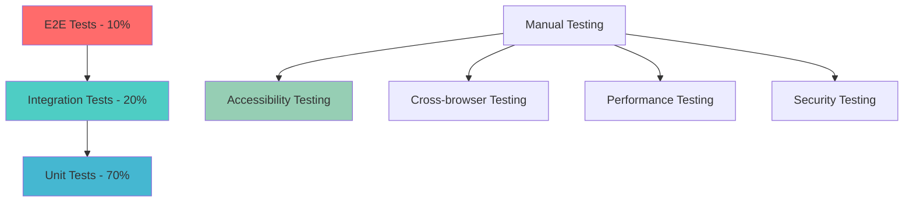

# Emoty Web App - Testing Strategy

## Overview

This document outlines a comprehensive testing strategy for the Emoty web application, ensuring high quality, accessibility compliance, and reliable functionality across all features including AI integration, voice commands, and pattern creation.

## Testing Pyramid Structure



## Unit Testing Strategy

### 1. Component Testing

#### Core Pattern Components

```typescript
// __tests__/components/PatternCanvas.test.tsx
import { render, fireEvent, waitFor } from '@testing-library/react';
import { axe, toHaveNoViolations } from 'jest-axe';
import PatternCanvas from '../PatternCanvas';

expect.extend(toHaveNoViolations);

describe('PatternCanvas', () => {
  const mockPattern = [
    [{ emoji: '❤️', row: 0, col: 0, layer: 0, isCenter: false }],
    [{ emoji: '💕', row: 1, col: 1, layer: 1, isCenter: true }]
  ];

  beforeEach(() => {
    // Mock Canvas API
    HTMLCanvasElement.prototype.getContext = jest.fn(() => ({
      drawImage: jest.fn(),
      clearRect: jest.fn(),
      fillRect: jest.fn(),
      scale: jest.fn(),
      save: jest.fn(),
      restore: jest.fn(),
    }));
  });

  it('renders pattern correctly', () => {
    const { getByRole } = render(
      <PatternCanvas pattern={mockPattern} />
    );
    
    const canvas = getByRole('img');
    expect(canvas).toBeInTheDocument();
    expect(canvas).toHaveAttribute('aria-label', expect.stringContaining('Emoji pattern'));
  });

  it('handles click interactions', () => {
    const onCellClick = jest.fn();
    const { getByRole } = render(
      <PatternCanvas 
        pattern={mockPattern} 
        onCellClick={onCellClick}
        readonly={false}
      />
    );

    const canvas = getByRole('img');
    fireEvent.click(canvas, { clientX: 50, clientY: 50 });
    
    expect(onCellClick).toHaveBeenCalledWith(expect.any(Number), expect.any(Number));
  });

  it('provides keyboard navigation', () => {
    const onCellClick = jest.fn();
    const { getByRole } = render(
      <PatternCanvas 
        pattern={mockPattern} 
        onCellClick={onCellClick}
        readonly={false}
      />
    );

    const canvas = getByRole('img');
    fireEvent.keyDown(canvas, { key: 'Enter' });
    
    expect(onCellClick).toHaveBeenCalled();
  });

  it('has no accessibility violations', async () => {
    const { container } = render(<PatternCanvas pattern={mockPattern} />);
    const results = await axe(container);
    expect(results).toHaveNoViolations();
  });

  it('handles reduced motion preferences', () => {
    // Mock prefers-reduced-motion
    Object.defineProperty(window, 'matchMedia', {
      writable: true,
      value: jest.fn().mockImplementation(query => ({
        matches: query === '(prefers-reduced-motion: reduce)',
        media: query,
        onchange: null,
        addListener: jest.fn(),
        removeListener: jest.fn(),
        addEventListener: jest.fn(),
        removeEventListener: jest.fn(),
        dispatchEvent: jest.fn(),
      })),
    });

    const { container } = render(
      <PatternCanvas pattern={mockPattern} animationEnabled={true} />
    );
    
    // Verify animations are disabled
    expect(container.querySelector('.pattern-animation')).toHaveStyle(
      'animation: none'
    );
  });
});
```

#### Emoji Picker Testing

```typescript
// __tests__/components/EmojiPicker.test.tsx
describe('EmojiPicker', () => {
  const mockEmojis = ['❤️', '😍', '🌸', '🎉'];

  it('displays all emojis in grid format', () => {
    const { getAllByRole } = render(
      <EmojiPicker emojis={mockEmojis} onSelect={jest.fn()} />
    );
    
    const buttons = getAllByRole('gridcell');
    expect(buttons).toHaveLength(mockEmojis.length);
  });

  it('handles emoji selection', () => {
    const onSelect = jest.fn();
    const { getByLabelText } = render(
      <EmojiPicker emojis={mockEmojis} onSelect={onSelect} />
    );
    
    const heartButton = getByLabelText(/heart/i);
    fireEvent.click(heartButton);
    
    expect(onSelect).toHaveBeenCalledWith('❤️');
  });

  it('supports keyboard navigation', () => {
    const onSelect = jest.fn();
    const { getByRole } = render(
      <EmojiPicker emojis={mockEmojis} onSelect={onSelect} />
    );
    
    const grid = getByRole('grid');
    
    // Test arrow key navigation
    fireEvent.keyDown(grid, { key: 'ArrowRight' });
    expect(document.activeElement).toHaveAttribute('aria-label', expect.stringContaining('😍'));
    
    // Test selection with Enter
    fireEvent.keyDown(document.activeElement, { key: 'Enter' });
    expect(onSelect).toHaveBeenCalledWith('😍');
  });

  it('maintains proper ARIA attributes', () => {
    const { getByRole, getAllByRole } = render(
      <EmojiPicker emojis={mockEmojis} onSelect={jest.fn()} selectedEmoji="❤️" />
    );
    
    const grid = getByRole('grid');
    expect(grid).toHaveAttribute('aria-label', 'Emoji selection grid');
    
    const buttons = getAllByRole('gridcell');
    buttons.forEach(button => {
      expect(button).toHaveAttribute('aria-label');
      expect(button).toHaveAttribute('aria-pressed');
    });
  });
});
```

### 2. Utility Function Testing

#### Pattern Algorithm Testing

```typescript
// __tests__/utils/pattern-generator.test.ts
import { PatternGenerator } from '../../lib/utils/pattern-generator';

describe('PatternGenerator', () => {
  describe('generateConcentricPattern', () => {
    it('creates correct pattern for single emoji', () => {
      const sequence = ['❤️'];
      const pattern = PatternGenerator.generateConcentricPattern(sequence);
      
      expect(pattern).toHaveLength(1);
      expect(pattern[0]).toHaveLength(1);
      expect(pattern[0][0].emoji).toBe('❤️');
      expect(pattern[0][0].isCenter).toBe(true);
    });

    it('creates correct pattern for multiple emojis', () => {
      const sequence = ['❤️', '💕', '💖'];
      const pattern = PatternGenerator.generateConcentricPattern(sequence);
      
      expect(pattern).toHaveLength(5); // (3 * 2) - 1
      expect(pattern[2][2].emoji).toBe('💖'); // Center emoji
      expect(pattern[0][0].emoji).toBe('❤️'); // Outer emoji
    });

    it('handles empty sequence gracefully', () => {
      const sequence: string[] = [];
      const pattern = PatternGenerator.generateConcentricPattern(sequence);
      
      expect(pattern).toHaveLength(0);
    });

    it('validates emoji characters', () => {
      const sequence = ['invalid', '❤️'];
      
      expect(() => {
        PatternGenerator.generateConcentricPattern(sequence);
      }).toThrow('Invalid emoji character');
    });
  });

  describe('performance', () => {
    it('generates large patterns efficiently', () => {
      const sequence = Array(10).fill('❤️');
      const start = performance.now();
      
      PatternGenerator.generateConcentricPattern(sequence);
      
      const duration = performance.now() - start;
      expect(duration).toBeLessThan(100); // Should complete in <100ms
    });
  });
});
```

#### Voice Command Processing

```typescript
// __tests__/utils/voice-processor.test.ts
import { VoiceProcessor } from '../../lib/utils/voice-processor';

describe('VoiceProcessor', () => {
  describe('parseCommand', () => {
    it('recognizes add emoji commands', () => {
      const result = VoiceProcessor.parseCommand('add heart', 'en');
      
      expect(result.intent).toBe('add_emoji');
      expect(result.parameters.emoji).toBe('❤️');
      expect(result.confidence).toBeGreaterThan(0.8);
    });

    it('handles French commands', () => {
      const result = VoiceProcessor.parseCommand('ajouter cœur', 'fr');
      
      expect(result.intent).toBe('add_emoji');
      expect(result.parameters.emoji).toBe('❤️');
    });

    it('recognizes pattern commands', () => {
      const result = VoiceProcessor.parseCommand('save pattern as birthday', 'en');
      
      expect(result.intent).toBe('save_pattern');
      expect(result.parameters.name).toBe('birthday');
    });

    it('handles ambiguous commands', () => {
      const result = VoiceProcessor.parseCommand('umm maybe add something', 'en');
      
      expect(result.confidence).toBeLessThan(0.5);
      expect(result.intent).toBe('unclear');
    });
  });
});
```

### 3. Hook Testing

#### Custom Hook Testing

```typescript
// __tests__/hooks/usePatternState.test.ts
import { renderHook, act } from '@testing-library/react';
import { usePatternState } from '../../hooks/usePatternState';

describe('usePatternState', () => {
  it('initializes with empty pattern', () => {
    const { result } = renderHook(() => usePatternState());
    
    expect(result.current.pattern.sequence).toHaveLength(0);
    expect(result.current.pattern.insertionIndex).toBe(0);
  });

  it('adds emoji to sequence', () => {
    const { result } = renderHook(() => usePatternState());
    
    act(() => {
      result.current.addEmoji('❤️');
    });
    
    expect(result.current.pattern.sequence).toContain('❤️');
    expect(result.current.pattern.insertionIndex).toBe(1);
  });

  it('maintains undo/redo history', () => {
    const { result } = renderHook(() => usePatternState());
    
    act(() => {
      result.current.addEmoji('❤️');
      result.current.addEmoji('💕');
    });
    
    expect(result.current.canUndo).toBe(true);
    
    act(() => {
      result.current.undo();
    });
    
    expect(result.current.pattern.sequence).toHaveLength(1);
    expect(result.current.canRedo).toBe(true);
  });

  it('validates pattern changes', () => {
    const { result } = renderHook(() => usePatternState());
    
    act(() => {
      // Try to add too many emojis
      for (let i = 0; i < 15; i++) {
        result.current.addEmoji('❤️');
      }
    });
    
    expect(result.current.pattern.sequence).toHaveLength(10); // Max limit
    expect(result.current.validationErrors).toContain('Maximum 10 emojis allowed');
  });
});
```

## Integration Testing

### 1. API Integration Tests

#### AI Pattern Generation

```typescript
// __tests__/integration/ai-pattern-generation.test.ts
import { rest } from 'msw';
import { setupServer } from 'msw/node';
import { generatePattern } from '../../lib/services/ai-service';

const server = setupServer(
  rest.post('/api/ai/generate-pattern', (req, res, ctx) => {
    return res(ctx.json({
      patterns: [{
        sequence: ['🌊', '💙'],
        rationale: 'Ocean waves pattern',
        confidence: 0.9,
        name: 'Ocean Waves',
        tags: ['nature', 'water']
      }],
      usage: { promptTokens: 50, completionTokens: 100, totalTokens: 150 }
    }));
  })
);

beforeAll(() => server.listen());
afterEach(() => server.resetHandlers());
afterAll(() => server.close());

describe('AI Pattern Generation Integration', () => {
  it('generates patterns from text prompt', async () => {
    const result = await generatePattern('ocean waves', 'en');
    
    expect(result.patterns).toHaveLength(1);
    expect(result.patterns[0].sequence).toEqual(['🌊', '💙']);
    expect(result.patterns[0].confidence).toBeGreaterThan(0.8);
  });

  it('handles API errors gracefully', async () => {
    server.use(
      rest.post('/api/ai/generate-pattern', (req, res, ctx) => {
        return res(ctx.status(500), ctx.json({ error: 'Service unavailable' }));
      })
    );

    const result = await generatePattern('test prompt', 'en');
    
    // Should return fallback pattern
    expect(result.patterns).toHaveLength(1);
    expect(result.patterns[0].sequence).toEqual(['🌟']);
  });

  it('respects rate limiting', async () => {
    const promises = Array(60).fill(null).map(() => 
      generatePattern('test', 'en')
    );

    const results = await Promise.allSettled(promises);
    const failures = results.filter(r => r.status === 'rejected');
    
    expect(failures.length).toBeGreaterThan(0);
  });
});
```

#### Voice Processing Integration

```typescript
// __tests__/integration/voice-processing.test.ts
describe('Voice Processing Integration', () => {
  beforeEach(() => {
    // Mock Web Speech API
    global.SpeechRecognition = jest.fn().mockImplementation(() => ({
      start: jest.fn(),
      stop: jest.fn(),
      addEventListener: jest.fn(),
      removeEventListener: jest.fn(),
    }));
  });

  it('processes voice commands end-to-end', async () => {
    const { result } = renderHook(() => useVoiceControl());
    
    await act(async () => {
      result.current.startListening();
    });
    
    // Simulate speech recognition result
    const mockEvent = {
      results: [{
        0: { transcript: 'add heart emoji' },
        isFinal: true
      }]
    };
    
    await act(async () => {
      result.current.handleSpeechResult(mockEvent);
    });
    
    expect(result.current.lastCommand).toEqual({
      intent: 'add_emoji',
      parameters: { emoji: '❤️' },
      confidence: expect.any(Number)
    });
  });

  it('handles speech recognition errors', async () => {
    const { result } = renderHook(() => useVoiceControl());
    
    await act(async () => {
      result.current.startListening();
    });
    
    // Simulate error
    await act(async () => {
      result.current.handleSpeechError({ error: 'network' });
    });
    
    expect(result.current.isListening).toBe(false);
    expect(result.current.error).toContain('network');
  });
});
```

### 2. Component Integration Tests

#### Pattern Creation Workflow

```typescript
// __tests__/integration/pattern-creation.test.tsx
describe('Pattern Creation Workflow', () => {
  it('creates pattern from emoji selection', async () => {
    const { getByRole, getByLabelText } = render(<PatternCreationPage />);
    
    // Select emoji from palette
    const heartEmoji = getByLabelText(/heart emoji/i);
    fireEvent.click(heartEmoji);
    
    // Verify pattern updates
    await waitFor(() => {
      const canvas = getByRole('img', { name: /emoji pattern/i });
      expect(canvas).toHaveAttribute('aria-label', expect.stringContaining('❤️'));
    });
    
    // Add another emoji
    const starEmoji = getByLabelText(/star emoji/i);
    fireEvent.click(starEmoji);
    
    // Verify sequence
    await waitFor(() => {
      const sequence = getByRole('list', { name: /emoji sequence/i });
      expect(sequence).toHaveTextContent('❤️');
      expect(sequence).toHaveTextContent('⭐');
    });
  });

  it('saves pattern with AI-generated name', async () => {
    const { getByRole, getByText } = render(<PatternCreationPage />);
    
    // Create pattern
    const heartEmoji = getByLabelText(/heart emoji/i);
    fireEvent.click(heartEmoji);
    
    // Save pattern
    const saveButton = getByRole('button', { name: /save pattern/i });
    fireEvent.click(saveButton);
    
    // Wait for AI name generation
    await waitFor(() => {
      expect(getByText(/pattern saved/i)).toBeInTheDocument();
    });
  });
});
```

## End-to-End Testing

### 1. Playwright E2E Tests

```typescript
// e2e/pattern-creation.spec.ts
import { test, expect } from '@playwright/test';

test.describe('Pattern Creation Flow', () => {
  test('creates and saves emoji pattern', async ({ page }) => {
    await page.goto('/');
    
    // Wait for page to load
    await expect(page.locator('[data-testid="pattern-canvas"]')).toBeVisible();
    
    // Select heart emoji
    await page.locator('[aria-label*="heart emoji"]').first().click();
    
    // Verify pattern updates
    await expect(page.locator('[data-testid="pattern-canvas"]')).toHaveAttribute(
      'aria-label', 
      /❤️/
    );
    
    // Add star emoji
    await page.locator('[aria-label*="star emoji"]').first().click();
    
    // Save pattern
    await page.locator('button:has-text("Save Pattern")').click();
    
    // Verify save confirmation
    await expect(page.locator('text=Pattern saved successfully')).toBeVisible();
  });

  test('uses voice commands to create pattern', async ({ page, context }) => {
    // Grant microphone permission
    await context.grantPermissions(['microphone']);
    
    await page.goto('/');
    
    // Start voice control
    await page.locator('[data-testid="voice-control-button"]').click();
    
    // Wait for listening state
    await expect(page.locator('text=Listening...')).toBeVisible();
    
    // Simulate voice command (in real test, would use actual speech)
    await page.evaluate(() => {
      window.dispatchEvent(new CustomEvent('voice-command', {
        detail: { transcript: 'add heart emoji', confidence: 0.9 }
      }));
    });
    
    // Verify emoji was added
    await expect(page.locator('[data-testid="pattern-canvas"]')).toHaveAttribute(
      'aria-label',
      /❤️/
    );
  });

  test('generates AI pattern from prompt', async ({ page }) => {
    await page.goto('/');
    
    // Open AI generator
    await page.locator('button:has-text("✨ AI Generator")').click();
    
    // Enter prompt
    await page.fill('[placeholder*="describe"]', 'ocean waves');
    
    // Generate patterns
    await page.locator('button:has-text("Generate Patterns")').click();
    
    // Wait for AI response
    await expect(page.locator('[data-testid="ai-pattern-suggestion"]').first()).toBeVisible();
    
    // Select first suggestion
    await page.locator('[data-testid="ai-pattern-suggestion"]').first().click();
    
    // Verify pattern was applied
    await expect(page.locator('[data-testid="pattern-canvas"]')).toHaveAttribute(
      'aria-label',
      /🌊|💙/
    );
  });
});
```

### 2. Accessibility E2E Tests

```typescript
// e2e/accessibility.spec.ts
import { test, expect } from '@playwright/test';
import AxeBuilder from '@axe-core/playwright';

test.describe('Accessibility Tests', () => {
  test('should not have any automatically detectable accessibility issues', async ({ page }) => {
    await page.goto('/');
    
    const accessibilityScanResults = await new AxeBuilder({ page }).analyze();
    
    expect(accessibilityScanResults.violations).toEqual([]);
  });

  test('keyboard navigation works correctly', async ({ page }) => {
    await page.goto('/');
    
    // Tab through interactive elements
    await page.keyboard.press('Tab');
    await expect(page.locator(':focus')).toHaveAttribute('aria-label');
    
    // Test emoji grid navigation
    await page.locator('[role="grid"]').first().focus();
    await page.keyboard.press('ArrowRight');
    await page.keyboard.press('Enter');
    
    // Verify emoji selection
    await expect(page.locator('[data-testid="pattern-canvas"]')).toHaveAttribute(
      'aria-label',
      /emoji pattern/
    );
  });

  test('screen reader announcements work', async ({ page }) => {
    await page.goto('/');
    
    // Monitor aria-live regions
    const announcements: string[] = [];
    
    page.on('domcontentloaded', async () => {
      await page.evaluate(() => {
        const observer = new MutationObserver((mutations) => {
          mutations.forEach((mutation) => {
            if (mutation.target instanceof Element && 
                mutation.target.getAttribute('aria-live')) {
              window.lastAnnouncement = mutation.target.textContent;
            }
          });
        });
        
        observer.observe(document.body, {
          childList: true,
          subtree: true,
          characterData: true
        });
      });
    });
    
    // Trigger pattern change
    await page.locator('[aria-label*="heart emoji"]').first().click();
    
    // Check for announcement
    const announcement = await page.evaluate(() => window.lastAnnouncement);
    expect(announcement).toContain('❤️');
  });
});
```

## Performance Testing

### 1. Load Testing

```typescript
// __tests__/performance/load.test.ts
import { performance } from 'perf_hooks';

describe('Performance Tests', () => {
  it('pattern generation completes within performance budget', async () => {
    const sequence = Array(10).fill('❤️');
    
    const start = performance.now();
    const pattern = PatternGenerator.generateConcentricPattern(sequence);
    const duration = performance.now() - start;
    
    expect(duration).toBeLessThan(100); // 100ms budget
    expect(pattern).toBeDefined();
  });

  it('canvas rendering performs at 60fps', async () => {
    const canvas = document.createElement('canvas');
    const ctx = canvas.getContext('2d')!;
    const renderer = new PatternRenderer(ctx);
    
    const pattern = PatternGenerator.generateConcentricPattern(['❤️', '💕']);
    
    const frameTargets = [];
    for (let i = 0; i < 60; i++) {
      const start = performance.now();
      renderer.render(pattern);
      const duration = performance.now() - start;
      frameTargets.push(duration);
    }
    
    const averageFrameTime = frameTargets.reduce((a, b) => a + b) / frameTargets.length;
    expect(averageFrameTime).toBeLessThan(16.67); // 60fps = 16.67ms per frame
  });

  it('AI API responses cached efficiently', async () => {
    const prompt = 'test pattern';
    
    // First call
    const start1 = performance.now();
    await generatePattern(prompt, 'en');
    const duration1 = performance.now() - start1;
    
    // Second call (should be cached)
    const start2 = performance.now();
    await generatePattern(prompt, 'en');
    const duration2 = performance.now() - start2;
    
    expect(duration2).toBeLessThan(duration1 * 0.1); // Should be 90% faster
  });
});
```

### 2. Memory Testing

```typescript
// __tests__/performance/memory.test.ts
describe('Memory Performance', () => {
  it('does not leak memory during pattern operations', () => {
    const initialMemory = performance.memory?.usedJSHeapSize || 0;
    
    // Perform 1000 pattern operations
    for (let i = 0; i < 1000; i++) {
      const pattern = PatternGenerator.generateConcentricPattern(['❤️', '💕']);
      // Simulate cleanup
      pattern.length = 0;
    }
    
    // Force garbage collection if available
    if (global.gc) {
      global.gc();
    }
    
    const finalMemory = performance.memory?.usedJSHeapSize || 0;
    const memoryIncrease = finalMemory - initialMemory;
    
    // Memory increase should be minimal (< 10MB)
    expect(memoryIncrease).toBeLessThan(10 * 1024 * 1024);
  });

  it('cleans up canvas resources properly', () => {
    const canvases: HTMLCanvasElement[] = [];
    
    // Create many canvases
    for (let i = 0; i < 100; i++) {
      const canvas = document.createElement('canvas');
      canvas.width = 400;
      canvas.height = 400;
      canvases.push(canvas);
    }
    
    // Clean up
    canvases.forEach(canvas => {
      const ctx = canvas.getContext('2d');
      if (ctx) {
        ctx.clearRect(0, 0, canvas.width, canvas.height);
      }
      canvas.width = 0;
      canvas.height = 0;
    });
    
    canvases.length = 0;
    
    // Memory should be released
    expect(canvases).toHaveLength(0);
  });
});
```

## Security Testing

### 1. Input Validation Tests

```typescript
// __tests__/security/input-validation.test.ts
describe('Security - Input Validation', () => {
  it('sanitizes AI prompts', () => {
    const maliciousPrompts = [
      '<script>alert("xss")</script>',
      'javascript:alert("xss")',
      '${eval("console.log(process.env)")}',
      '{{constructor.constructor("alert(1)")()}}'
    ];
    
    maliciousPrompts.forEach(prompt => {
      const sanitized = sanitizePrompt(prompt);
      expect(sanitized).not.toContain('<script>');
      expect(sanitized).not.toContain('javascript:');
      expect(sanitized).not.toContain('${');
      expect(sanitized).not.toContain('{{');
    });
  });

  it('validates emoji inputs', () => {
    const invalidInputs = [
      '',
      '&#x1F600;', // HTML entity
      'not_an_emoji',
      ''
    ];
    
    invalidInputs.forEach(input => {
      expect(() => validateEmoji(input)).toThrow('Invalid emoji');
    });
  });

  it('prevents prototype pollution', () => {
    const maliciousPattern = {
      sequence: ['❤️'],
      '__proto__': { isAdmin: true }
    };
    
    const sanitized = sanitizePatternData(maliciousPattern);
    expect(sanitized).not.toHaveProperty('__proto__');
    expect(Object.prototype.isAdmin).toBeUndefined();
  });
});
```

### 2. Rate Limiting Tests

```typescript
// __tests__/security/rate-limiting.test.ts
describe('Security - Rate Limiting', () => {
  it('enforces API rate limits', async () => {
    const requests = Array(60).fill(null).map(() => 
      fetch('/api/ai/generate-pattern', {
        method: 'POST',
        body: JSON.stringify({ prompt: 'test' })
      })
    );
    
    const results = await Promise.allSettled(requests);
    const rateLimited = results.filter(r => 
      r.status === 'fulfilled' && r.value.status === 429
    );
    
    expect(rateLimited.length).toBeGreaterThan(0);
  });

  it('implements proper CORS headers', async () => {
    const response = await fetch('/api/patterns', {
      method: 'OPTIONS'
    });
    
    expect(response.headers.get('Access-Control-Allow-Origin')).toBeDefined();
    expect(response.headers.get('Access-Control-Allow-Methods')).toBeDefined();
  });
});
```

## CI/CD Testing Pipeline

### GitHub Actions Configuration

```yaml
# .github/workflows/test.yml
name: Comprehensive Testing

on:
  push:
    branches: [main, develop]
  pull_request:
    branches: [main]

jobs:
  unit-tests:
    runs-on: ubuntu-latest
    steps:
      - uses: actions/checkout@v4
      - uses: actions/setup-node@v4
        with:
          node-version: '18'
          cache: 'npm'
      
      - run: npm ci
      - run: npm run test:unit -- --coverage
      - run: npm run test:accessibility
      
      - name: Upload coverage
        uses: codecov/codecov-action@v3
        with:
          file: ./coverage/lcov.info

  integration-tests:
    runs-on: ubuntu-latest
    needs: unit-tests
    steps:
      - uses: actions/checkout@v4
      - uses: actions/setup-node@v4
        with:
          node-version: '18'
          cache: 'npm'
      
      - run: npm ci
      - run: npm run test:integration

  e2e-tests:
    runs-on: ubuntu-latest
    needs: integration-tests
    steps:
      - uses: actions/checkout@v4
      - uses: actions/setup-node@v4
        with:
          node-version: '18'
          cache: 'npm'
      
      - run: npm ci
      - run: npx playwright install
      - run: npm run test:e2e
      
      - name: Upload test results
        uses: actions/upload-artifact@v3
        if: failure()
        with:
          name: playwright-report
          path: playwright-report/

  performance-tests:
    runs-on: ubuntu-latest
    steps:
      - uses: actions/checkout@v4
      - uses: actions/setup-node@v4
        with:
          node-version: '18'
          cache: 'npm'
      
      - run: npm ci
      - run: npm run test:performance
      
      - name: Lighthouse CI
        run: |
          npm install -g @lhci/cli@0.12.x
          lhci autorun

  security-tests:
    runs-on: ubuntu-latest
    steps:
      - uses: actions/checkout@v4
      - uses: actions/setup-node@v4
        with:
          node-version: '18'
          cache: 'npm'
      
      - run: npm ci
      - run: npm audit --audit-level moderate
      - run: npm run test:security
      
      - name: OWASP ZAP Scan
        uses: zaproxy/action-baseline@v0.7.0
        with:
          target: 'http://localhost:3000'
```

## Test Coverage Requirements

### Coverage Targets

- **Unit Tests**: 90% line coverage, 85% branch coverage
- **Integration Tests**: 80% of API endpoints
- **E2E Tests**: 100% of critical user paths
- **Accessibility Tests**: 100% of interactive components

### Coverage Reporting

```json
// jest.config.js
{
  "collectCoverageFrom": [
    "src/**/*.{ts,tsx}",
    "!src/**/*.d.ts",
    "!src/**/*.stories.tsx",
    "!src/test/**/*"
  ],
  "coverageThreshold": {
    "global": {
      "branches": 85,
      "functions": 90,
      "lines": 90,
      "statements": 90
    },
    "./src/components/": {
      "branches": 90,
      "functions": 95,
      "lines": 95,
      "statements": 95
    }
  }
}
```

## Manual Testing Procedures

### 1. Cross-browser Testing Matrix

| Feature | Chrome | Firefox | Safari | Edge | Mobile Chrome | Mobile Safari |
|---------|--------|---------|--------|------|---------------|---------------|
| Pattern Creation | ✓ | ✓ | ✓ | ✓ | ✓ | ✓ |
| Voice Commands | ✓ | ✓ | ⚠️ | ✓ | ✓ | ❌ |
| AI Generation | ✓ | ✓ | ✓ | ✓ | ✓ | ✓ |
| Touch Gestures | N/A | N/A | N/A | N/A | ✓ | ✓ |

### 2. Device Testing Matrix

| Device Type | Screen Size | Touch | Voice | Performance |
|-------------|-------------|-------|-------|-------------|
| Desktop | 1920x1080+ | Mouse | Microphone | High |
| Laptop | 1366x768+ | Trackpad | Microphone | High |
| Tablet | 768x1024 | Touch | Microphone | Medium |
| Phone | 375x667+ | Touch | Microphone | Medium |

### 3. Accessibility Testing Checklist

```markdown
## Screen Reader Testing
- [ ] VoiceOver (macOS/iOS) - Pattern navigation works
- [ ] NVDA (Windows) - All content announced correctly
- [ ] JAWS (Windows) - Form interactions accessible
- [ ] TalkBack (Android) - Mobile app fully usable

## Keyboard Navigation
- [ ] Tab order logical and complete
- [ ] All interactive elements reachable
- [ ] Focus indicators visible and clear
- [ ] No keyboard traps
- [ ] Arrow key navigation in grids works

## Motor Accessibility
- [ ] Touch targets minimum 44px
- [ ] No required complex gestures
- [ ] Voice control alternatives available
- [ ] Adequate spacing between elements

## Visual Accessibility
- [ ] Color contrast ratios meet WCAG AA (4.5:1)
- [ ] High contrast mode supported
- [ ] 200% zoom functional
- [ ] No information conveyed by color alone
- [ ] Text scalable without horizontal scrolling

## Cognitive Accessibility
- [ ] Instructions clear and simple
- [ ] Error messages helpful and specific
- [ ] Consistent navigation patterns
- [ ] No time limits or clear extensions
- [ ] Complex interactions can be undone
```

---

*This comprehensive testing strategy ensures the Emoty web application meets the highest standards of quality, accessibility, performance, and security across all supported platforms and use cases.*