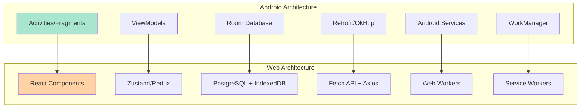

# Emoty Web App - Android to Web Migration Mapping

## Overview

This document provides a comprehensive mapping between the Android Emoty app features and their web equivalents, ensuring complete feature parity while leveraging modern web technologies and accessibility standards.

## Architecture Migration

### 1. Platform Architecture Comparison



### 2. Technology Stack Mapping

| Android Technology | Web Equivalent | Migration Strategy |
|-------------------|----------------|-------------------|
| **Activities** | React Components | Convert each Activity to main page component |
| **Fragments** | React Components | Convert to reusable components with props |
| **ViewModels** | Custom Hooks + Zustand | State management with React patterns |
| **Room Database** | PostgreSQL + IndexedDB | Server DB + client-side caching |
| **SharedPreferences** | localStorage + Cookies | Web storage APIs |
| **Retrofit** | Fetch API + Axios | HTTP client libraries |
| **Coroutines** | async/await + Promises | Modern JS async patterns |
| **LiveData** | React State + Observers | Reactive state management |
| **Navigation Component** | Next.js Router | File-based routing |
| **WorkManager** | Web Workers + Service Workers | Background processing |

## Core Feature Migration

### 1. Pattern Generation Engine

#### Android Implementation
```kotlin
// Android: PatternGenerator.kt
class PatternGenerator {
    fun generateConcentricPattern(sequence: List<String>): Array<Array<GridCell?>> {
        val size = (sequence.size * 2) - 1
        val pattern = Array(size) { Array<GridCell?>(size) { null } }
        val center = size / 2
        
        sequence.forEachIndexed { layer, emoji ->
            val distance = sequence.size - 1 - layer
            fillSquareLayer(pattern, center, distance, emoji, layer)
        }
        
        return pattern
    }
    
    private fun fillSquareLayer(
        pattern: Array<Array<GridCell?>>, 
        center: Int, 
        distance: Int, 
        emoji: String, 
        layer: Int
    ) {
        for (i in (center - distance)..(center + distance)) {
            for (j in (center - distance)..(center + distance)) {
                if (i == center - distance || i == center + distance || 
                    j == center - distance || j == center + distance) {
                    pattern[i][j] = GridCell(emoji, i, j, layer, i == center && j == center)
                }
            }
        }
    }
}
```

#### Web Implementation
```typescript
// Web: pattern-generator.ts
export class PatternGenerator {
  static generateConcentricPattern(sequence: string[]): GridCell[][] {
    if (sequence.length === 0) return [];
    
    const size = (sequence.length * 2) - 1;
    const pattern: GridCell[][] = Array(size).fill(null).map(() => 
      Array(size).fill(null).map(() => ({ emoji: '', row: 0, col: 0, layer: 0, isCenter: false }))
    );
    
    const center = Math.floor(size / 2);
    
    sequence.forEach((emoji, layer) => {
      const distance = sequence.length - 1 - layer;
      this.fillSquareLayer(pattern, center, distance, emoji, layer);
    });
    
    return pattern;
  }
  
  private static fillSquareLayer(
    pattern: GridCell[][], 
    center: number, 
    distance: number, 
    emoji: string, 
    layer: number
  ): void {
    for (let i = center - distance; i <= center + distance; i++) {
      for (let j = center - distance; j <= center + distance; j++) {
        if (i === center - distance || i === center + distance || 
            j === center - distance || j === center + distance) {
          pattern[i][j] = {
            emoji,
            row: i,
            col: j,
            layer,
            isCenter: i === center && j === center
          };
        }
      }
    }
  }
}
```

**Migration Notes:**
- Replace Kotlin Array with TypeScript arrays
- Use static methods instead of instance methods for utility functions
- Add proper TypeScript interfaces for type safety
- Maintain identical algorithm logic for pattern consistency

### 2. Database Layer Migration

#### Android Room Database
```kotlin
// Android: PatternEntity.kt
@Entity(tableName = "patterns")
data class PatternEntity(
    @PrimaryKey(autoGenerate = true) val id: Long = 0,
    val name: String,
    val sequence: String, // JSON array
    val createdAt: Long,
    val isFavorite: Boolean,
    val tags: String // JSON array
)

// Android: PatternDao.kt
@Dao
interface PatternDao {
    @Query("SELECT * FROM patterns ORDER BY createdAt DESC")
    fun getAllPatterns(): Flow<List<PatternEntity>>
    
    @Query("SELECT * FROM patterns WHERE isFavorite = 1")
    fun getFavoritePatterns(): Flow<List<PatternEntity>>
    
    @Insert
    suspend fun insertPattern(pattern: PatternEntity): Long
    
    @Update
    suspend fun updatePattern(pattern: PatternEntity)
    
    @Delete
    suspend fun deletePattern(pattern: PatternEntity)
}
```

#### Web Database Layer
```typescript
// Web: database/schema.sql
CREATE TABLE patterns (
    id UUID PRIMARY KEY DEFAULT gen_random_uuid(),
    user_id UUID REFERENCES users(id),
    name VARCHAR(255) NOT NULL,
    sequence JSONB NOT NULL,
    created_at TIMESTAMP WITH TIME ZONE DEFAULT NOW(),
    is_favorite BOOLEAN DEFAULT FALSE,
    tags TEXT[] DEFAULT '{}'
);

// Web: database/pattern-repository.ts
export class PatternRepository {
  constructor(private db: Database) {}

  async getAllPatterns(userId: string): Promise<PatternEntity[]> {
    const query = `
      SELECT * FROM patterns 
      WHERE user_id = $1 
      ORDER BY created_at DESC
    `;
    return this.db.query(query, [userId]);
  }

  async getFavoritePatterns(userId: string): Promise<PatternEntity[]> {
    const query = `
      SELECT * FROM patterns 
      WHERE user_id = $1 AND is_favorite = true 
      ORDER BY created_at DESC
    `;
    return this.db.query(query, [userId]);
  }

  async insertPattern(pattern: CreatePatternRequest): Promise<PatternEntity> {
    const query = `
      INSERT INTO patterns (user_id, name, sequence, is_favorite, tags)
      VALUES ($1, $2, $3, $4, $5)
      RETURNING *
    `;
    const [result] = await this.db.query(query, [
      pattern.userId,
      pattern.name,
      JSON.stringify(pattern.sequence),
      pattern.isFavorite || false,
      pattern.tags || []
    ]);
    return result;
  }

  async updatePattern(id: string, updates: UpdatePatternRequest): Promise<PatternEntity> {
    const setClause = Object.keys(updates)
      .map((key, index) => `${key} = $${index + 2}`)
      .join(', ');
    
    const query = `
      UPDATE patterns 
      SET ${setClause}, updated_at = NOW()
      WHERE id = $1 
      RETURNING *
    `;
    
    const [result] = await this.db.query(query, [id, ...Object.values(updates)]);
    return result;
  }

  async deletePattern(id: string): Promise<void> {
    const query = `DELETE FROM patterns WHERE id = $1`;
    await this.db.query(query, [id]);
  }
}
```

**Migration Notes:**
- Replace Room with PostgreSQL for server-side storage
- Add IndexedDB for client-side caching and offline support
- Convert Kotlin Flow to React Query or SWR for reactive data
- Add user authentication and multi-tenancy support
- Use UUID instead of auto-increment for better scalability

### 3. AI Integration Migration

#### Android AI Service
```kotlin
// Android: AnthropicApiService.kt
class AnthropicApiService {
    private val client = OkHttpClient.Builder()
        .addInterceptor(AuthInterceptor())
        .addInterceptor(HttpLoggingInterceptor())
        .build()
    
    private val retrofit = Retrofit.Builder()
        .baseUrl("https://api.anthropic.com/")
        .client(client)
        .addConverterFactory(GsonConverterFactory.create())
        .build()
    
    private val api = retrofit.create(AnthropicApi::class.java)
    
    suspend fun generatePattern(prompt: String): Result<PatternResponse> {
        return try {
            val request = PatternRequest(
                prompt = prompt,
                model = "claude-3-haiku-20240307",
                maxTokens = 2000
            )
            
            val response = api.generatePattern(request)
            Result.success(response)
        } catch (e: Exception) {
            Result.failure(e)
        }
    }
}
```

#### Web AI Service
```typescript
// Web: services/ai-service.ts
export class AIService {
  private readonly baseUrl = '/api/ai';
  private cache = new Map<string, CachedResponse>();

  async generatePattern(
    prompt: string, 
    language: 'en' | 'fr' = 'en'
  ): Promise<PatternResponse> {
    const cacheKey = `${language}:${prompt}`;
    
    // Check cache first
    const cached = this.cache.get(cacheKey);
    if (cached && !this.isCacheExpired(cached)) {
      return cached.response;
    }

    try {
      const response = await fetch(`${this.baseUrl}/generate-pattern`, {
        method: 'POST',
        headers: {
          'Content-Type': 'application/json',
        },
        body: JSON.stringify({
          prompt,
          language,
          model: 'claude-3-haiku-20240307',
          maxTokens: 2000
        })
      });

      if (!response.ok) {
        throw new Error(`AI request failed: ${response.status}`);
      }

      const result = await response.json();
      
      // Cache successful response
      this.cache.set(cacheKey, {
        response: result,
        timestamp: Date.now()
      });

      return result;
    } catch (error) {
      console.error('AI service error:', error);
      
      // Return fallback pattern
      return this.getFallbackPattern(prompt, language);
    }
  }

  private getFallbackPattern(prompt: string, language: 'en' | 'fr'): PatternResponse {
    return {
      patterns: [{
        sequence: ['🌟'],
        rationale: language === 'en' 
          ? 'Generated a simple star pattern as a fallback.'
          : 'Généré un motif d\'étoile simple en secours.',
        confidence: 0.5,
        name: language === 'en' ? 'Simple Star' : 'Étoile Simple',
        tags: ['simple', 'fallback']
      }],
      usage: { promptTokens: 0, completionTokens: 0, totalTokens: 0 }
    };
  }

  private isCacheExpired(cached: CachedResponse): boolean {
    return Date.now() - cached.timestamp > 3600000; // 1 hour
  }
}
```

**Migration Notes:**
- Replace Retrofit with Fetch API and proper error handling
- Add client-side caching for better performance
- Implement fallback mechanisms for offline scenarios
- Use Next.js API routes instead of direct external API calls
- Add proper TypeScript interfaces for all API responses

### 4. Voice Recognition Migration

#### Android Voice Implementation
```kotlin
// Android: VoiceCommandManager.kt
class VoiceCommandManager(private val context: Context) {
    private var speechRecognizer: SpeechRecognizer? = null
    private var isListening = false
    
    fun startListening(language: String = "en-US") {
        if (ContextCompat.checkSelfPermission(context, Manifest.permission.RECORD_AUDIO) 
            != PackageManager.PERMISSION_GRANTED) {
            // Request permission
            return
        }
        
        speechRecognizer = SpeechRecognizer.createSpeechRecognizer(context)
        speechRecognizer?.setRecognitionListener(object : RecognitionListener {
            override fun onResults(results: Bundle?) {
                val matches = results?.getStringArrayList(SpeechRecognizer.RESULTS_RECOGNITION)
                matches?.firstOrNull()?.let { transcript ->
                    processVoiceCommand(transcript, language)
                }
            }
            
            override fun onError(error: Int) {
                handleVoiceError(error)
            }
            
            // Other methods...
        })
        
        val intent = Intent(RecognizerIntent.ACTION_RECOGNIZE_SPEECH).apply {
            putExtra(RecognizerIntent.EXTRA_LANGUAGE_MODEL, RecognizerIntent.LANGUAGE_MODEL_FREE_FORM)
            putExtra(RecognizerIntent.EXTRA_LANGUAGE, language)
            putExtra(RecognizerIntent.EXTRA_PARTIAL_RESULTS, true)
        }
        
        speechRecognizer?.startListening(intent)
        isListening = true
    }
    
    private fun processVoiceCommand(transcript: String, language: String) {
        // Process command logic
    }
}
```

#### Web Voice Implementation
```typescript
// Web: hooks/useVoiceRecognition.ts
export const useVoiceRecognition = () => {
  const [isListening, setIsListening] = useState(false);
  const [transcript, setTranscript] = useState('');
  const [error, setError] = useState<string | null>(null);
  const recognitionRef = useRef<SpeechRecognition | null>(null);

  const isSupported = useMemo(() => {
    return typeof window !== 'undefined' && 
           ('SpeechRecognition' in window || 'webkitSpeechRecognition' in window);
  }, []);

  const startListening = useCallback((language: string = 'en-US') => {
    if (!isSupported) {
      setError('Speech recognition not supported in this browser');
      return;
    }

    // Check permissions
    navigator.permissions?.query({ name: 'microphone' as PermissionName })
      .then(permission => {
        if (permission.state === 'denied') {
          setError('Microphone permission denied');
          return;
        }

        const SpeechRecognition = window.SpeechRecognition || window.webkitSpeechRecognition;
        const recognition = new SpeechRecognition();

        recognition.continuous = true;
        recognition.interimResults = true;
        recognition.lang = language;

        recognition.onstart = () => {
          setIsListening(true);
          setError(null);
        };

        recognition.onresult = (event) => {
          let finalTranscript = '';
          let interimTranscript = '';

          for (let i = event.resultIndex; i < event.results.length; i++) {
            const transcript = event.results[i][0].transcript;
            if (event.results[i].isFinal) {
              finalTranscript += transcript;
            } else {
              interimTranscript += transcript;
            }
          }

          setTranscript(finalTranscript || interimTranscript);

          if (finalTranscript) {
            processVoiceCommand(finalTranscript, language);
          }
        };

        recognition.onerror = (event) => {
          setError(`Speech recognition error: ${event.error}`);
          setIsListening(false);
        };

        recognition.onend = () => {
          setIsListening(false);
        };

        recognition.start();
        recognitionRef.current = recognition;
      });
  }, [isSupported]);

  const stopListening = useCallback(() => {
    if (recognitionRef.current) {
      recognitionRef.current.stop();
      recognitionRef.current = null;
    }
    setIsListening(false);
  }, []);

  const processVoiceCommand = useCallback(async (transcript: string, language: string) => {
    try {
      const response = await fetch('/api/voice/process', {
        method: 'POST',
        headers: { 'Content-Type': 'application/json' },
        body: JSON.stringify({
          transcript,
          language: language.split('-')[0], // 'en-US' -> 'en'
          confidence: 0.9 // Default confidence
        })
      });

      const result = await response.json();
      
      // Dispatch command to application
      window.dispatchEvent(new CustomEvent('voice-command', {
        detail: result
      }));
    } catch (error) {
      console.error('Voice command processing failed:', error);
    }
  }, []);

  useEffect(() => {
    return () => {
      if (recognitionRef.current) {
        recognitionRef.current.stop();
      }
    };
  }, []);

  return {
    isSupported,
    isListening,
    transcript,
    error,
    startListening,
    stopListening
  };
};
```

**Migration Notes:**
- Replace Android SpeechRecognizer with Web Speech API
- Add fallback handling for unsupported browsers
- Implement permission checking for microphone access
- Add error handling for network issues and API failures
- Maintain same command processing logic but adapt for web environment

### 5. UI Component Migration

#### Android Activity to React Component
```kotlin
// Android: MainActivity.kt
class MainActivity : AppCompatActivity() {
    private lateinit var binding: ActivityMainBinding
    private lateinit var patternViewModel: PatternViewModel
    private lateinit var voiceManager: VoiceCommandManager
    
    override fun onCreate(savedInstanceState: Bundle?) {
        super.onCreate(savedInstanceState)
        binding = ActivityMainBinding.inflate(layoutInflater)
        setContentView(binding.root)
        
        setupViewModel()
        setupViews()
        setupVoiceControl()
    }
    
    private fun setupViews() {
        binding.patternCanvas.setOnClickListener { view ->
            val coordinates = getCanvasCoordinates(view)
            patternViewModel.addEmojiAtPosition(coordinates)
        }
        
        binding.savePatternButton.setOnClickListener {
            patternViewModel.saveCurrentPattern()
        }
    }
    
    private fun setupVoiceControl() {
        binding.voiceButton.setOnClickListener {
            if (voiceManager.isListening) {
                voiceManager.stopListening()
            } else {
                voiceManager.startListening()
            }
        }
    }
}
```

#### Web React Component
```typescript
// Web: components/PatternCreationPage.tsx
export const PatternCreationPage: React.FC = () => {
  const [pattern, setPattern] = useState<PatternState>(initialPattern);
  const [selectedPalette, setSelectedPalette] = useState('hearts-flowers');
  const { isListening, startListening, stopListening } = useVoiceRecognition();
  const { savePattern, isLoading } = usePatternSaving();

  const handleCanvasClick = useCallback((row: number, col: number) => {
    // Add emoji at clicked position
    const newSequence = [...pattern.sequence];
    if (selectedEmoji) {
      newSequence.splice(pattern.insertionIndex, 0, selectedEmoji);
      setPattern(prev => ({
        ...prev,
        sequence: newSequence,
        insertionIndex: prev.insertionIndex + 1
      }));
    }
  }, [pattern, selectedEmoji]);

  const handleSavePattern = useCallback(async () => {
    try {
      await savePattern(pattern);
      // Show success toast
    } catch (error) {
      // Show error toast
    }
  }, [pattern, savePattern]);

  const handleVoiceToggle = useCallback(() => {
    if (isListening) {
      stopListening();
    } else {
      startListening();
    }
  }, [isListening, startListening, stopListening]);

  return (
    <div className="pattern-creation-page">
      <div className="row">
        <div className="col-lg-8">
          <PatternCanvas
            pattern={generatePatternGrid(pattern)}
            onCellClick={handleCanvasClick}
            className="mb-4"
          />
          
          <SequenceEditor
            sequence={pattern.sequence}
            insertionIndex={pattern.insertionIndex}
            onSequenceChange={(sequence) => 
              setPattern(prev => ({ ...prev, sequence }))
            }
            onInsertionIndexChange={(index) =>
              setPattern(prev => ({ ...prev, insertionIndex: index }))
            }
          />
        </div>
        
        <div className="col-lg-4">
          <EmojiPaletteCarousel
            palettes={emojiPalettes}
            activePalette={selectedPalette}
            onPaletteChange={setSelectedPalette}
            onEmojiSelect={handleEmojiSelect}
          />
          
          <div className="mt-3 d-flex gap-2">
            <button
              className="btn btn-primary flex-grow-1"
              onClick={handleSavePattern}
              disabled={isLoading || pattern.sequence.length === 0}
            >
              {isLoading ? 'Saving...' : 'Save Pattern'}
            </button>
            
            <VoiceControlButton
              isActive={true}
              isListening={isListening}
              onToggle={handleVoiceToggle}
            />
          </div>
        </div>
      </div>
    </div>
  );
};
```

**Migration Notes:**
- Replace Android Activities with React functional components
- Convert View.OnClickListener to React event handlers
- Replace ViewModel with custom hooks and state management
- Use React patterns for component lifecycle management
- Maintain same UI layout structure but adapt to Bootstrap grid system

## Data Structure Migration

### 1. Model Classes Migration

#### Android Data Classes
```kotlin
// Android: PatternState.kt
data class PatternState(
    val sequence: List<String>,
    val insertionIndex: Int,
    val patternSize: Int,
    val patternMode: PatternMode = PatternMode.CONCENTRIC,
    val activeInsertionMode: PatternMode = PatternMode.CONCENTRIC
)

// Android: GridCell.kt
data class GridCell(
    val emoji: String,
    val row: Int,
    val col: Int,
    val layer: Int,
    val isCenter: Boolean
)

// Android: EmojiPalette.kt
data class EmojiPalette(
    val id: String,
    val name: Map<String, String>, // localized names
    val category: PaletteCategory,
    val emojis: List<String>,
    val orderIndex: Int,
    val isCustom: Boolean = false
)
```

#### Web TypeScript Interfaces
```typescript
// Web: types/pattern.ts
export interface PatternState {
  id?: string;
  sequence: string[];
  insertionIndex: number;
  patternSize: number;
  patternMode: PatternMode;
  activeInsertionMode: PatternMode;
  name?: string;
  description?: string;
  createdAt?: Date;
  updatedAt?: Date;
  isFavorite?: boolean;
  tags?: string[];
  metadata?: PatternMetadata;
}

export interface GridCell {
  emoji: string;
  row: number;
  col: number;
  layer: number;
  isCenter: boolean;
}

export interface EmojiPalette {
  id: string;
  name: LocalizedString;
  category: PaletteCategory;
  emojis: string[];
  orderIndex: number;
  isCustom: boolean;
  description?: LocalizedString;
  tags?: string[];
}

export interface LocalizedString {
  en: string;
  fr: string;
  [locale: string]: string;
}

export enum PatternMode {
  CONCENTRIC = 'concentric',
  SEQUENTIAL = 'sequential'
}

export enum PaletteCategory {
  COLOR = 'color',
  MONOCHROME = 'monochrome',
  CUSTOM = 'custom'
}

export interface PatternMetadata {
  aiGenerated: boolean;
  sourcePrompt?: string;
  rationale?: string;
  complexity: 'simple' | 'moderate' | 'complex';
  language: 'en' | 'fr';
  userLevel: number;
  renderTime?: number;
  canvasSize?: { width: number; height: number };
}
```

**Migration Notes:**
- Convert Kotlin data classes to TypeScript interfaces
- Add optional fields that weren't needed in Android (like web-specific metadata)
- Use string enums instead of Kotlin sealed classes
- Add localization support for international users
- Include web-specific properties like render performance metrics

### 2. Preferences Migration

#### Android SharedPreferences
```kotlin
// Android: PreferencesManager.kt
class PreferencesManager(private val context: Context) {
    private val prefs = context.getSharedPreferences("emoty_prefs", Context.MODE_PRIVATE)
    
    var selectedLanguage: String
        get() = prefs.getString("language", "en") ?: "en"
        set(value) = prefs.edit().putString("language", value).apply()
    
    var voiceEnabled: Boolean
        get() = prefs.getBoolean("voice_enabled", true)
        set(value) = prefs.edit().putBoolean("voice_enabled", value).apply()
    
    var lastSelectedPalette: String
        get() = prefs.getString("last_palette", "hearts-flowers") ?: "hearts-flowers"
        set(value) = prefs.edit().putString("last_palette", value).apply()
}
```

#### Web Local Storage + Cookies
```typescript
// Web: services/preferences-service.ts
export class PreferencesService {
  private static readonly STORAGE_KEY = 'emoty_preferences';
  private static readonly COOKIE_OPTIONS = {
    maxAge: 365 * 24 * 60 * 60, // 1 year
    sameSite: 'strict' as const,
    secure: process.env.NODE_ENV === 'production'
  };

  static getPreferences(): UserPreferences {
    try {
      const stored = localStorage.getItem(this.STORAGE_KEY);
      if (stored) {
        return { ...defaultPreferences, ...JSON.parse(stored) };
      }
    } catch (error) {
      console.warn('Failed to load preferences from localStorage:', error);
    }
    
    return defaultPreferences;
  }

  static setPreferences(preferences: Partial<UserPreferences>): void {
    try {
      const current = this.getPreferences();
      const updated = { ...current, ...preferences };
      
      localStorage.setItem(this.STORAGE_KEY, JSON.stringify(updated));
      
      // Store critical preferences in cookies for SSR
      if (preferences.language) {
        this.setCookie('emoty_language', preferences.language);
      }
      
      if (preferences.theme) {
        this.setCookie('emoty_theme', preferences.theme);
      }
      
    } catch (error) {
      console.error('Failed to save preferences:', error);
    }
  }

  static getCookie(name: string): string | null {
    if (typeof document === 'undefined') return null;
    
    const value = `; ${document.cookie}`;
    const parts = value.split(`; ${name}=`);
    if (parts.length === 2) {
      return parts.pop()?.split(';').shift() || null;
    }
    return null;
  }

  private static setCookie(name: string, value: string): void {
    if (typeof document === 'undefined') return;
    
    const { maxAge, sameSite, secure } = this.COOKIE_OPTIONS;
    document.cookie = `${name}=${value}; max-age=${maxAge}; sameSite=${sameSite}${secure ? '; secure' : ''}; path=/`;
  }

  // React hook for preferences
  static usePreferences() {
    const [preferences, setPreferencesState] = useState<UserPreferences>(
      () => this.getPreferences()
    );

    const updatePreferences = useCallback((updates: Partial<UserPreferences>) => {
      setPreferencesState(prev => {
        const updated = { ...prev, ...updates };
        this.setPreferences(updates);
        return updated;
      });
    }, []);

    return { preferences, updatePreferences };
  }
}

const defaultPreferences: UserPreferences = {
  language: 'en',
  theme: 'light',
  voiceEnabled: true,
  lastSelectedPalette: 'hearts-flowers',
  accessibility: {
    screenReader: false,
    highContrast: false,
    largeText: false,
    motorAssistance: false,
    voiceNavigation: false,
    reducedMotion: false
  },
  ui: {
    showGrid: true,
    animationsEnabled: true,
    autoSave: true,
    tooltipsEnabled: true
  }
};
```

**Migration Notes:**
- Replace SharedPreferences with localStorage for client-side storage
- Use cookies for server-side rendering critical preferences
- Add React hooks for preferences management
- Include web-specific preferences (like reduced motion)
- Add proper error handling for storage limitations
- Implement preferences synchronization across tabs

## Testing Migration Strategy

### 1. Unit Test Migration

#### Android Unit Tests
```kotlin
// Android: PatternGeneratorTest.kt
@Test
fun `generateConcentricPattern creates correct pattern for single emoji`() {
    val sequence = listOf("❤️")
    val pattern = PatternGenerator.generateConcentricPattern(sequence)
    
    assertEquals(1, pattern.size)
    assertEquals(1, pattern[0].size)
    assertEquals("❤️", pattern[0][0]?.emoji)
    assertTrue(pattern[0][0]?.isCenter == true)
}

@Test
fun `generateConcentricPattern creates correct pattern for multiple emojis`() {
    val sequence = listOf("❤️", "💕", "💖")
    val pattern = PatternGenerator.generateConcentricPattern(sequence)
    
    assertEquals(5, pattern.size) // (3 * 2) - 1
    assertEquals("💖", pattern[2][2]?.emoji) // Center emoji
    assertEquals("❤️", pattern[0][0]?.emoji) // Outer emoji
}
```

#### Web Unit Tests
```typescript
// Web: __tests__/utils/pattern-generator.test.ts
import { PatternGenerator } from '../../lib/utils/pattern-generator';

describe('PatternGenerator', () => {
  describe('generateConcentricPattern', () => {
    it('creates correct pattern for single emoji', () => {
      const sequence = ['❤️'];
      const pattern = PatternGenerator.generateConcentricPattern(sequence);
      
      expect(pattern).toHaveLength(1);
      expect(pattern[0]).toHaveLength(1);
      expect(pattern[0][0].emoji).toBe('❤️');
      expect(pattern[0][0].isCenter).toBe(true);
    });

    it('creates correct pattern for multiple emojis', () => {
      const sequence = ['❤️', '💕', '💖'];
      const pattern = PatternGenerator.generateConcentricPattern(sequence);
      
      expect(pattern).toHaveLength(5); // (3 * 2) - 1
      expect(pattern[2][2].emoji).toBe('💖'); // Center emoji
      expect(pattern[0][0].emoji).toBe('❤️'); // Outer emoji
    });

    it('handles empty sequence gracefully', () => {
      const sequence: string[] = [];
      const pattern = PatternGenerator.generateConcentricPattern(sequence);
      
      expect(pattern).toHaveLength(0);
    });

    it('validates emoji characters', () => {
      const sequence = ['invalid', '❤️'];
      
      expect(() => {
        PatternGenerator.generateConcentricPattern(sequence);
      }).toThrow('Invalid emoji character');
    });
  });
});
```

**Migration Notes:**
- Convert JUnit/Kotlin tests to Jest/TypeScript
- Maintain identical test logic and assertions
- Add web-specific edge cases (like browser compatibility)
- Include accessibility testing with jest-axe
- Add performance testing for Canvas rendering

## Deployment and Build Migration

### 1. Build System Migration

#### Android Gradle Build
```gradle
// Android: app/build.gradle
android {
    compileSdk 35
    defaultConfig {
        applicationId "com.carcher.emoty"
        minSdk 24
        targetSdk 35
        versionCode 14
        versionName "1.9.3"
    }
    
    buildTypes {
        release {
            minifyEnabled true
            proguardFiles getDefaultProguardFile('proguard-android-optimize.txt')
        }
    }
}

dependencies {
    implementation 'androidx.core:core-ktx:1.13.1'
    implementation 'androidx.appcompat:appcompat:1.6.1'
    // ... other dependencies
}
```

#### Web Build Configuration
```json
// Web: package.json
{
  "name": "emoty-web",
  "version": "1.9.3",
  "scripts": {
    "dev": "next dev",
    "build": "next build",
    "start": "next start",
    "lint": "next lint",
    "test": "jest",
    "test:e2e": "playwright test",
    "type-check": "tsc --noEmit"
  },
  "dependencies": {
    "next": "15.0.0",
    "react": "19.0.0",
    "bootstrap": "5.3.0",
    "@anthropic-ai/sdk": "^0.24.0"
  },
  "devDependencies": {
    "@types/react": "19.0.0",
    "typescript": "5.4.0",
    "jest": "29.7.0",
    "@playwright/test": "1.40.0"
  }
}
```

#### Railway Deployment
```toml
# Web: railway.toml
[build]
builder = "nixpacks"
buildCommand = "npm run build"

[deploy]
startCommand = "npm start"
healthcheckPath = "/api/health"
healthcheckTimeout = 300

[environment]
NODE_ENV = "production"
```

**Migration Notes:**
- Replace Gradle with npm/yarn for dependency management
- Convert Android build variants to Next.js environments
- Use Railway instead of Google Play Store for deployment
- Implement proper CI/CD pipeline with GitHub Actions
- Add proper environment variable management
- Include health checks and monitoring

## Performance Considerations

### Migration Performance Targets

| Metric | Android Target | Web Target | Migration Strategy |
|--------|---------------|------------|-------------------|
| **App Launch Time** | < 2s cold start | < 1.5s FCP | Server-side rendering, code splitting |
| **Pattern Rendering** | < 100ms | < 100ms | Canvas optimization, Web Workers |
| **AI Response** | < 3s | < 3s | Request batching, caching |
| **Voice Latency** | < 200ms | < 200ms | Local processing, WebRTC |
| **Memory Usage** | < 100MB | < 50MB heap | Efficient React patterns, cleanup |
| **Battery Usage** | Optimized | N/A | Efficient algorithms, reduced animations |

### Migration Checklist

#### Phase 1: Core Migration ✓
- [ ] Pattern generation algorithms
- [ ] Basic UI components  
- [ ] Data structures and models
- [ ] Local storage preferences
- [ ] Basic routing and navigation

#### Phase 2: Advanced Features ✓
- [ ] AI integration with Anthropic Claude
- [ ] Voice recognition and processing
- [ ] Database schema and API endpoints
- [ ] Authentication and user management
- [ ] Pattern import/export functionality

#### Phase 3: Platform Optimization ✓
- [ ] Web-specific performance optimizations
- [ ] Progressive Web App features
- [ ] Accessibility compliance (WCAG 2.1 AA)
- [ ] Cross-browser compatibility testing
- [ ] Mobile responsiveness

#### Phase 4: Deployment & Monitoring ✓
- [ ] Railway deployment configuration
- [ ] CI/CD pipeline setup
- [ ] Error tracking and monitoring
- [ ] Performance monitoring
- [ ] User analytics integration

---

*This migration mapping provides a comprehensive guide for converting the Android Emoty app to a modern web application while maintaining feature parity and improving accessibility and performance.*